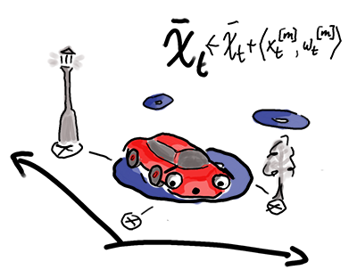
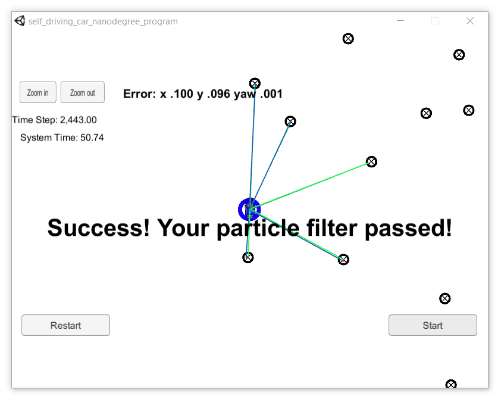

# Self Driving Car Engineer Project 8 - Localizing the Kidnapped Vehicle with Particle Filters
## Benjamin Söllner, 05 Sep 2017

---



---

Your robot has been kidnapped and transported to a new location! Luckily it has a map of this location, a (noisy) GPS estimate of its initial location, and lots of (noisy) sensor and control data.

In this project I am utilizing a 2-dimensional particle filter to predict the location of a simulated car (characterized by yaw rate, position and velocity) with a particle filter of roughly 100 particles. The particle filter is given a map and some initial localization information (analogous to what a GPS would provide). At each time step your filter will also get observation and control data.

The project is part of the Udacity Self Driving Car Engineer Nanodegree and involves the Term 2 Simulator which can be downloaded [here](https://github.com/udacity/self-driving-car-sim/releases).



## Making

This repository includes two files that can be used to set up and intall uWebSocketIO for either Linux or Mac systems. For windows you can use either Docker, VMware, or even Windows 10 Bash on Ubuntu to install uWebSocketIO.

Once the install for uWebSocketIO is complete, the main program can be built and ran by doing the following from the project top directory.

mkdir build
cd build
cmake ..
make
./particle_filter

The project can also be built with Microsoft Visual Studio [according to a useful article from Fahid Zubair](https://medium.com/@fzubair/udacity-carnd-term2-visual-studio-2015-17-setup-cca602e0b1cd).

## Submitted Files

* [``README.md``](README.md), [``readme.html``](readme.html): you are reading it! :)
* [``src/particle_filter.cpp``](src/particle_filter.cpp): Particle Filter implementation

## Interface

Here is the main protcol that main.cpp uses for uWebSocketIO in communicating with the simulator.

```
INPUT: values provided by the simulator to the c++ program

// sense noisy position data from the simulator
["sense_x"]
["sense_y"]
["sense_theta"]
// get the previous velocity and yaw rate to predict the particle's transitioned state
["previous_velocity"]
["previous_yawrate"]
// receive noisy observation data from the simulator, in a respective list of x/y values
["sense_observations_x"]
["sense_observations_y"]


OUTPUT: values provided by the c++ program to the simulator

// best particle values used for calculating the error evaluation
["best_particle_x"]
["best_particle_y"]
["best_particle_theta"]
// Optional message data used for debugging particle's sensing and associations
// for respective (x,y) sensed positions ID label
["best_particle_associations"]
// for respective (x,y) sensed positions
["best_particle_sense_x"] <= list of sensed x positions
["best_particle_sense_y"] <= list of sensed y positions
```

## Inputs to the Particle Filter
You can find the inputs to the particle filter in the `data` directory.

`map_data.txt` includes the position of landmarks (in meters) on an arbitrary Cartesian coordinate system (data provided by 3D Mapping Solutions GmbH). Each row has three columns:
1. x position
2. y position
3. landmark id

All other data the simulator provides, such as observations and controls.
